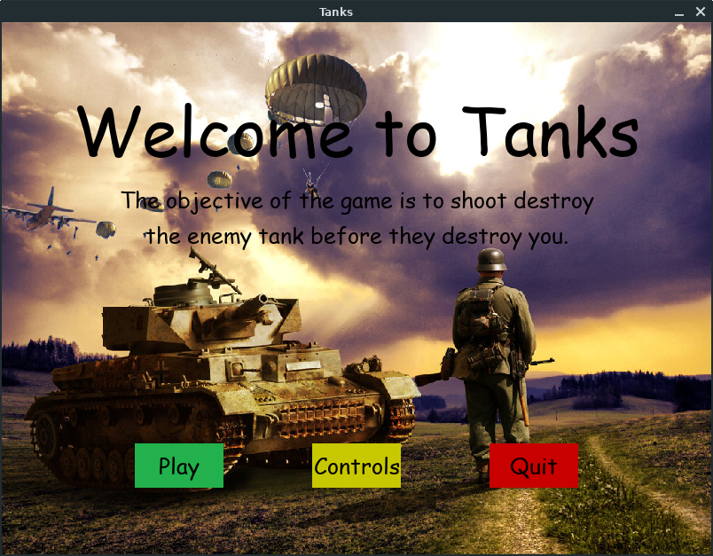

# Tanks

It is a battle of tanks.

-----

## :crystal_ball: Prerequisites

You need pygame to run this.
Run this code in terminal if you dont have it.
- For Windows
```
pip install pygame
```
- For Linux
```
pip3 install pygame
```

----------

## :camera: Screenshot



----------

## :floppy_disk: Get Started

- clone this repo by typing this command in terminal
```
git clone git@github.com:rohitjoshi21/Tanks.git
```
- when you have cloned the repo, simply run the .py file in terminal 
```
python3 Game.py
```
----------

## :hammer: Built With

- [pygame](https://github.com/pygame/) - Library for digital arts, games and music.

----------

## :octocat: Author

[@rohitjoshi21](https://github.com/rohitjoshi21)
