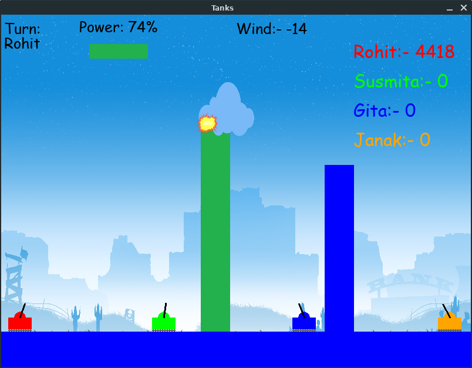

# Tanks

It is a battle of tanks. I have tried to make this game for learning purpose and the idea behind this game is not mine. I have just written the codes of this game.

-----

## :crystal_ball: Prerequisites

You need pygame to run this.
Run this code in terminal if you dont have it.
- For Windows
```
pip install pygame
```
- For Linux
```
pip3 install pygame
```

----------

## :camera: Screenshot




----------

## :floppy_disk: Get Started

- clone this repo by typing this command in terminal
```
git clone git@github.com:rohitjoshi21/Tanks.git
```

- After cloning the repository, change the directory to Tanks.

```
cd Tanks
```

- when you have cloned the repo, simply run the .py file in terminal 

```
python3 main.py
```
----------

## :hammer: Built With

- [pygame](https://github.com/pygame/) - Library for digital arts, games and music.

----------

## :octocat: Author

[Rohit Joshi](https://github.com/rohitjoshi21)

---------

## :octocat: Contributors

[Pradeep Bhattarai](https://github.com/pr0d33p)
